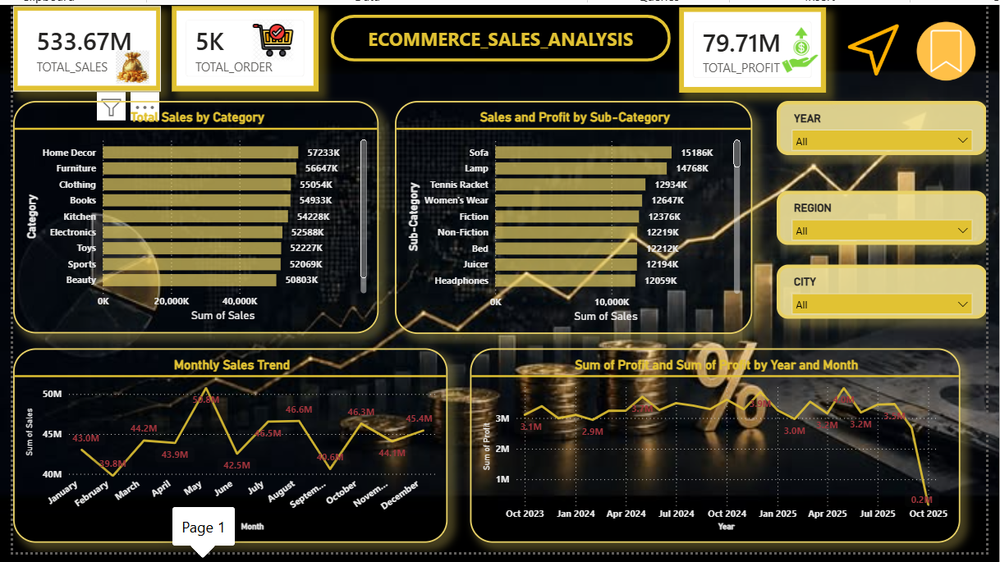
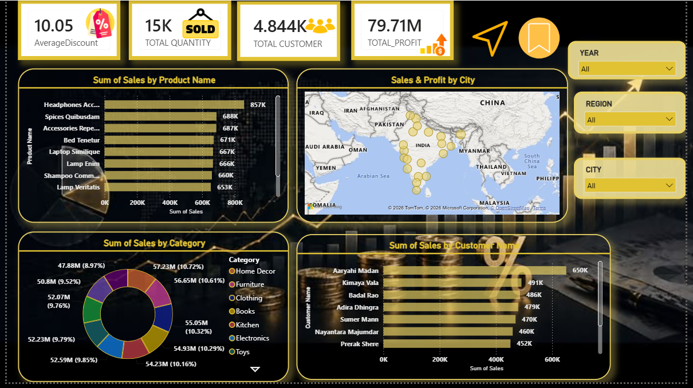
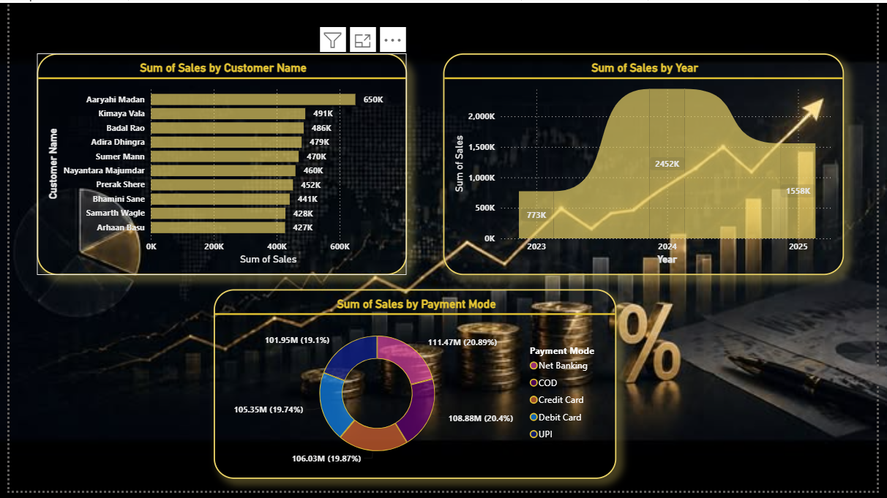

# 📊 E-Commerce Sales Dashboard | Power BI

## 📌 Project Overview

This project is an interactive Power BI dashboard built to analyze e-commerce sales performance. The dashboard provides insights into sales, profit, customer behavior, product performance, and regional sales using interactive visualizations and DAX measures.

---

## 🎯 Project Objectives

- Analyze overall sales and profit performance.
- Identify top-performing categories, products, and customers.
- Compare monthly sales and profit trends.
- Visualize sales distribution across different cities.
- Enable interactive filtering using slicers.

---

## 🛠️ Tools & Technologies

- Microsoft Power BI
- Power Query
- DAX (Data Analysis Expressions)
- Excel / CSV Dataset

---

## 📈 Key Performance Indicators (KPIs)

- Total Sales
- Total Profit
- Total Orders
- Total Customers
- Average Sales per Customer
- Average Profit per Customer
- Profit Margin (%)

---

## 📊 Dashboard Features

### Page 1 – Executive Summary
- KPI Cards
- Sales by Category
- Sales by Sub-Category
- Monthly Sales Trend
- Monthly Profit Trend
- Year, Region, and City slicers

### Page 2 – Sales Analysis
- Top Products by Sales
- Sales Distribution by City (Map)
- Sales Contribution by Category (Donut Chart)
- Top Customers by Sales

---

## 📷 Dashboard Preview

### Page 1

### Page 2

### Page 3

---

## 📂 Files Included

- Ecommerce Dashboard.pbix
- Dataset.csv
- Dashboard_Page1.png
- Dashboard_Page2.png
- Dashboard_Page3.png
- README.md

---

## 💡 Key Insights

- Home Decor generated the highest sales among all categories.
- Monthly sales peaked in May.
- Monthly profit remained relatively stable throughout the year.
- Sales are distributed across multiple cities with strong performance in major urban locations.
- A small group of customers contributed significantly to total sales.

---

## 👨‍💻 Author

**Vasanth M**

- LinkedIn: https://www.linkedin.com/in/vasanth-muthuraman33
- GitHub: https://github.com/VASANTH-TECH795
